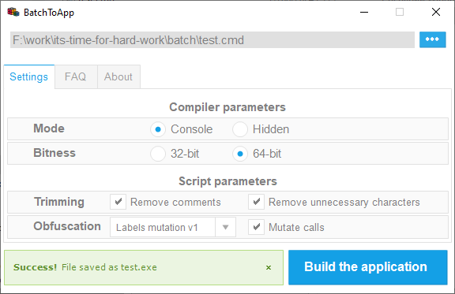
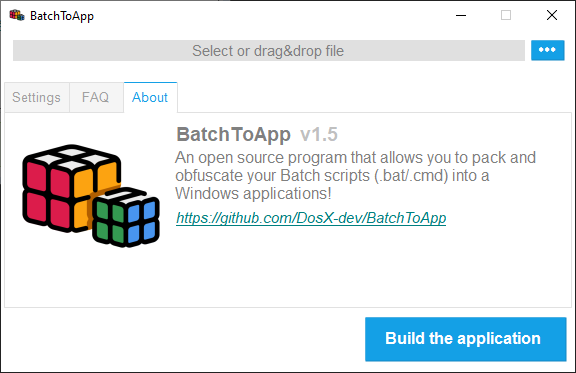

# BatchToApp
### Program that allows you to **pack** and **obfuscate** your Batch scripts (`.bat`/`.cmd`) into a Windows applications (`.exe`)

### > **[Download for Windows](https://github.com/DosX-dev/BatchToApp/releases/tag/Builds)**

---

> Screenshots
>
> 
> 

The script file after conversion can still:
 * Receive and process command line arguments
 * Return value of `%ERRORLEVEL%`

## Functionality
**BatchToApp** can create 32 or 64 bit applications, with or without hiding the console. There are also completely unique script trimming functions that include:
 * Comments removing (all lines starting with `::` or `rem` will be removed)
 * Unnecessary characters removing (this means reducing the number of line breaks, removing extra spaces)

How does BatchToApp obfuscate scripts?
Labels obfuscation modes:
* `Labels mutation` (only changes names)
* `Labels mutation` (changes names and adds junks)

To visually obfuscate many commands, you can use the `Mutate calls` option.

## Developer notes
> [!WARNING]
> Antiviruses treat packed files with contempt, so false positives may appear. It's sad, but these are the realities. Ignore this or install a valid CodeSigning digital signature on the file