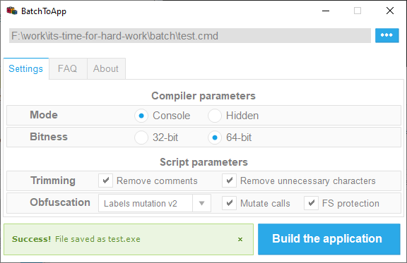

# BatchToApp
Program that allows you to pack your Batch scripts (`.bat`/`.cmd`) into a Windows applications (`.exe`)

> **[Download for Windows](https://github.com/DosX-dev/BatchToApp/releases/tag/Builds)**

> Screenshots
>
> 
> 

The script file after conversion can still:
 * Receive and process command line arguments
 * Return value of `%ERRORLEVEL%`

## Functionality
**BatchToApp** can create 32 or 64 bit applications, with or without hiding the console. There are also completely unique script trimming functions that include:
 * Comments removing
 * Unnecessary characters removing